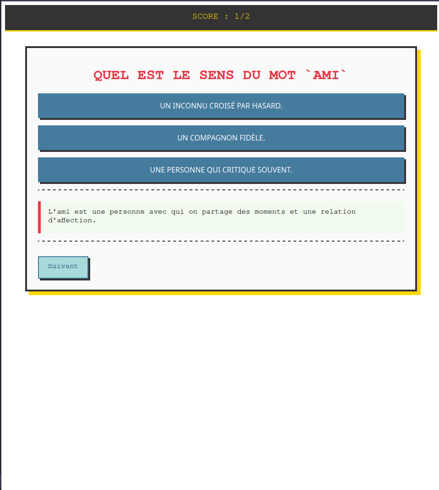

# QCM

Un simple système de QCM/Quizz, facilement modifiable avec banque de question chargeable au format `JSON` facilement.
Tout est construit autour du travail du vocabulaire, et donc de faire déviner le sens d'un mot !



Vous êtes libre de modifier le projet ou de contribuer.

## Essayer

Vous pouvez essayer la version du dépot ici :
[https://asymetricdata.github.io/word_quizz/priv/static/](https://asymetricdata.github.io/word_quizz/priv/static/)

Après avoir cloné le dépot actuel, vous pouvez directement tester le projet, j'ai laissé dans `priv/static/` le fichier converti en JS, ainsi qu'un index.html.
Il ne vous reste qu'à servir en local le contenu du dossier.

## "Hacker" le projet

### Installer Gleam

La documentation officielle vous expliquera tout : https://gleam.run/getting-started/installing/

Si vous utilisez VSCode comme éditeur, un plugin existe dans le marketplace !

Pour les utilisateur d'éditeur modal/terminal, la prise en charge est native pour `helix`, et `*vim` possède des plugins de très bonne qualité.

### Lancer le serveur local

Si vous avec `make`, vous pouvez utiliser le Makefile du dépot :
`make dev`

Sinon :
```sh
gleam run -m lustre/dev start
```

### Choix du langage

Le projet est construit avec Gleam, un langage fonctionnel moderne qui se transforme en JavaScript et Erlang. Ici on utilise la sortie JavaScript.

Le langage est simple et fiable grâce à son inspiration du monde fonctionnel et son analyse statique qui évite des erreurs. Toutes les erreurs sont expliquées par le compilateur lui-même !

Par dessus Gleam, le framework web *Lustre* est utilisé. Léger et puissant, il répond à tous les besoins que ce type de petite application peut avoir.

Une langage simple + un langage fiable = un langage parfait pour des projets communautaires.

```
Gleam de par sa nature est moins permissif que JavaScript voire TypeScript et peu detecter des erreurs avant l'execution du code.
C'est un gain de temps précieux !
```

### Format des questions

Pour rendre le projet facilement "hackable" et personnalisable,  le format des questions est volontairement simpliste.

Exemple (words.json) :
```json
    {
      "word": "Ami",
      "answer": "Un compagnon fidèle.",
      "choices": [
        "Un inconnu croisé par hasard.",
        "Un compagnon fidèle.",
        "Une personne qui critique souvent."
      ],
      "solution": "L'ami est une personne avec qui on partage des moments et une relation d'affection."
    },
```
Le but est de faire deviner le mot, donc son premier élement est le mot en questin, qui sera affiché dans la question principale.

Comme tout quizz, il y a plusieurs choix possible (choices) et une bonne réponse (answer).

La solution parle pour elle-même.

Le format est volontairement simpliste pour permettre à tous de faire ses propres listes de questions facilement !


## Contribuer

Voir [CONTRIBUTING.md](/CONTRIBUTING.md)
